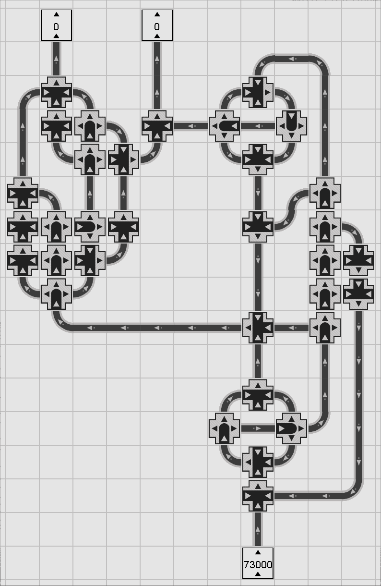

# PipeSim

PipeSim is a small Java/Swing sandbox for building pipe networks on a grid and simulating one-step fluid movement through components such as pipes, curved pipes, bridges, splitters, convergers, and tanks.

The editor lets you place and rotate components, configure tank contents, step the simulation manually, or run it continuously to watch fluid propagate through the network.

## Features

- Grid-based pipe network editor
- Interactive placement, selection, movement, and deletion tools
- One-step fluid simulation with support for bridges, splitters, convergers, and mirrored curved pipes
- Manual stepping, play/stop animation, and fast-run execution
- Save/load support for `.pipesim` layouts

## Controls

- `1` Pipe
- `2` Curved Pipe
- `3` Bridge
- `4` Splitter
- `5` Converger
- `R` Rotate selected placement component
- `Shift+R` Rotate backward
- `Delete` Delete selected components
- Left click to place or edit
- Right click to cancel placement or delete a component
